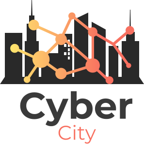
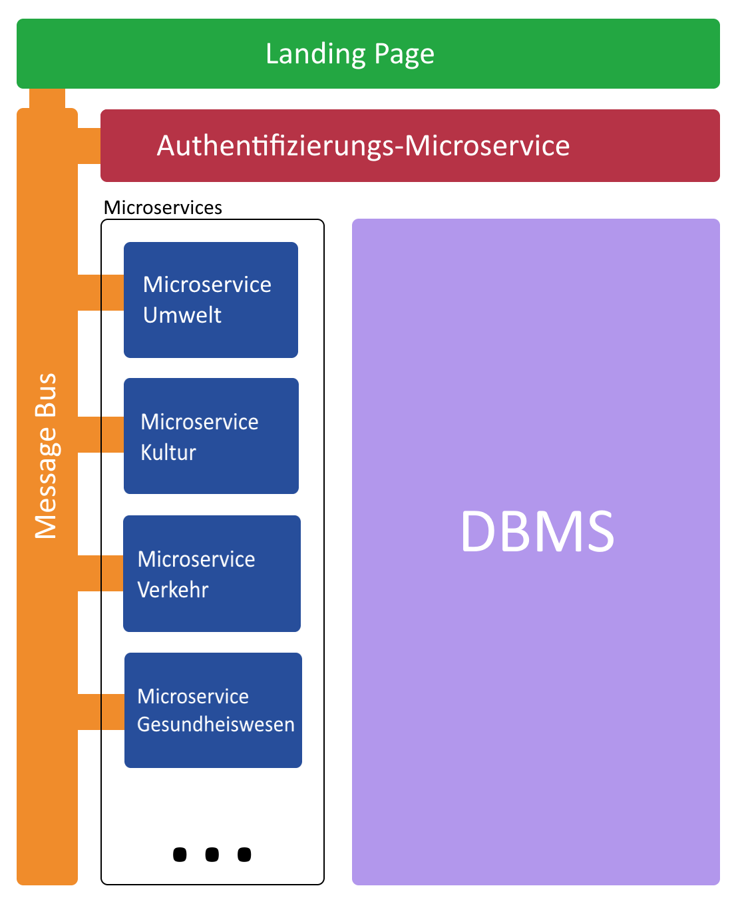
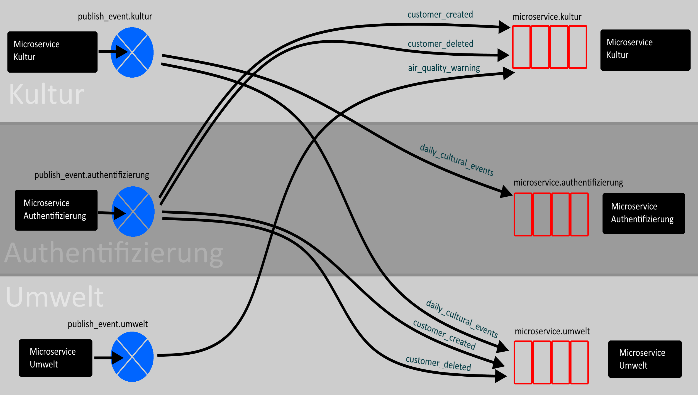

# Projektübersicht *CyberCity*

**Autor:** Tim Bollmeyer




## Beschreibung

Ob Einkaufen, die Arbeit, Bildung oder Kommunikation. Der Alltag vieler Menschen findet zunehmend digital statt. Höchste Zeit auch das städtische Leben mit all seinen Facetten digital abzubilden. Unsere ***CyberCity*** legt den nötigen Grundstein. Auf dieser digitalen Plattform finden sich die kommunalen Angebote und Informationen aus den Bereichen Kultur, Gesundheitswesen, Verkehr, Unternehmen und Umwelt. 

## Github Repository

Zur Umsetzung der ***CyberCity*** haben wir die *GitHub-Organisation* [Software-Projekt-2022](https://github.com/Software-Projekt-2022) aufgesetzt.
Dort finden sich alle Repositories zu diesem Projekt. <br>
Das [Dokumentation Repository](https://github.com/Software-Projekt-2022/Dokumentation) enthält alle Spezifikationen und Dokumentationen der Microservices und die Protokolle der gemeinsamen Meetings.

Die [Projektorganisation](_einleitung/projektorganisation) findet über das [Kanban-Board](https://github.com/orgs/Software-Projekt-2022/projects/1) auf Organisations-Ebene statt, um einen Gesamtüberblick über das gesamte Projekt zu bekommen.

## Ziele

Mit den Bereichen:
- Kultur
- Gesundheitswesen
- Verkehr
- Unternehmen
- Umwelt

wollen wir im Rahmen des Sommersemesters 2022 die wichtigsten Aspekte des Alltags unserer Bürger digital abbilden. <br>


Die Zielbenutzergruppen der Services unterliegen keinen Einschränkungen.
Vermutlich lassen sich die ersten Nutzer als jung und technik-affin charakterisieren. Diese *Early-Adopters* sind jedoch nicht die alleinige Zielgruppe.
Alle Bürger der CyberCity, unabhängig von Alter, Bildung, Erfahrung etc., sollen diese digitale Plattform nutzen können.

Klar abzugrenzen ist dieses Softwaresystem von eher datengetriebenen SmartCity-Ideen, die mit Sensorik, Big Data und Machine Learning die Stadt der Zukunft optimieren.
Wir setzen an der digitalen Transformation städtischer Angebote an. <br>
Bei uns steht der Bürger im Mittelpunkt. Wir wollen Zugang und Möglichkeiten zum digitalen Leben von morgen schaffen.

## Risiken

| Stärken      | Schwächen           | 
| :-------------: | :-------------: | 
| <ul><li>item1</li><li>item2</li></ul>| <ul><li>item1</li><li>item2</li></ul> |
|  || |
| **Chancen** | **Risiken** | 
| <ul><li>item1</li><li>item2</li></ul>| <ul><li>item1</li><li>item2</li></ul> |

Die Fähigkeiten und Erfahrungen einzelner Teammitglieder unterscheiden sich teilweise stark.
Bisher hat auch noch niemand einen kompletten Microservice alleine implementiert. 
Mit gutem Zusammenhalt im Team und dem Willen weitere notwendige Kompetenzen gemeinsam zu erlernen, halten wir das Projekt aber insgesamt für umsetzbar.

Das Projekt wird in dem Modul `Softwareprojekt` umgesetzt. Parallel finden viele weitere Module in diesem Semester statt, sodass schlechtes Zeitmanagement und schlechte Organisation große Risiken für das Projekt darstellen. <br>
Auf Produkt-Ebene muss darauf geachtet werden, dass es keine große Abhängigkeiten zwischen einzelnen Microservices gibt.
Jeder Microservice muss als geschlossenes System funktionieren, damit auch dann ein funktionierendes Gesamtprodukt entstehen kann, wenn es zu weiteren unvorhergesehenen Ereignissen kommt.

## Stakeholder

| Funktion / Relevanz | Name | Kontakt / Verfügbarkeit | Wissen  | Interessen / Ziele  | 
|---|---|---|---|---| 
| Kommunal-Politiker | Herr Schmidt | schmidt@gmx.de | Kennt Angebot und Nachfrage städtischer Angebote | Digitalisierung der Stadt vorantreiben |
| Ansprechperson ÖPNV-Verbund | Frau Tannenbaum | marietb@gmail.com | Chancen und Herausforderungen des städtischen Verkehrs | Möchte ÖPNV-Angebot der Stadt digital zugänglich machen |
| Referenz-Bürger | Frau Meier  | mmeier@outlook.de, Verfügbarkeit für erste Usertests | Kennt die Bedürfnisse der Bürger | Möchte Alltag digitaler und moderner gestalten können |
| Dozent, "Auftraggeber" | Herr Prof. Dr. Brunsmann | joerg.brunsmann@fh-bielefeld.de | Softwaretechnik und Programmierung | Umfangreiches Gesamtprodukt, gute Teamarbeit |
| Product-Owner, Entscheider - als Koordinator der Stakeholderanforderungen | Tim Bollmeyer |  tim.bollmeyer@fh-bielefeld.de, Verfügbarkeit 100%, Minden  | Koordinator für die Inputs der Stakeholder  | ROI des Systems sicherstellen  | 

## Systemübersicht



### Event Bus

Der Event Bus wird mit RabbitMQ umgesetzt.
Jeder Microservice hat eine Queue namens `microservice.<name>`, wobei `name` der Name des Microservices ist.
Jeder Microservice hat eine Exchange vom Typ `direct` namens `publish_event.<name>`, wobei `name` auch der Name des Microservices ist.

| Microservice         | Queue-Name                          | Exchange-Name                        |
| -------------------- | ----------------------------------- | ------------------------------------ |
| Unternehmensregister | `microservice.unternehmensregister` | `publish_event.unternehmensregister` |
| Authentifizierung    | `microservice.authentifizierung`    | `publish_event.authentifizierung`    |
| Umwelt               | `microservice.umwelt`               | `publish_event.umwelt`               |
| Gesundheitswesen     | `microservice.gesundheitswesen`     | `publish_event.gesundheitswesen`     |
| Kultur               | `microservice.kultur`               | `publish_event.kultur`               |
| Verkehr              | `microservice.verkehr`              | `publish_event.verkehr`              |
| Landing Page         | `microservice.landing_page`         | `publish_event.landing_page`         |

Die Queues empfangen alle Events, die an die zugehörigen Microservices gerichtet sind.
Die Microservices können Events versenden, indem sie diese an die zugehörigen Exchanges sendet.
Microservices können auswählen, von welchem Microservice sie welche Events bekommen möchten.

Damit ein Microservice ein Event mit seiner Queue empfangen kann, muss er ein Binding zwischen seiner Queue und der Exchange des
versendenden Microservices herstellen. Dabei hat das Binding als Routing Key den Namen des Events, welches empfangen werden soll.
Wenn ein Micoservice ein Event an seine Exchange sendet, wird dieses über das Binding an die richtige Queue gesendet.
Dazu muss der Microservice beim Senden auch den Rounting Key auf dem Namen des Events setzen.
Zeigen mehrere Bindings auf die Exchange, wird das Event an alle Queues mit einem Binding geschickt.
Auf diese Weise können mehrere Microservices das selbe Event von dem selben Microservice empfangen.

Zusätzlich gibt es noch eine weitere Exchange mit dem Namen `publish_event.global`, welche benutzt wird, wenn ein Event
nicht von einem Microservice gesendet wird, sondern z. B. von einem Admin.



Die blauen Kreise sind Exchanges und die roten Rechtecke sind Queues.
Die Pfeile sind Bindings mit dem Routing Key.
In diesem Diagramm wird die folgende Situation dargestellt:

| Microservice         | empfängt Event          | von Microservice  |
| -------------------- | ----------------------- | ----------------- |
| Authentifizierung    | `daily_cultural_events` | Kultur            |
| Umwelt               | `daily_cultural_events` | Kultur            |
| Umwelt               | `customer_created`      | Authentifizierung |
| Umwelt               | `customer_deleted`      | Authentifizierung |
| Kultur               | `customer_created`      | Authentifizierung |
| Kultur               | `customer_deleted`      | Authentifizierung |
| Kultur               | `air_quality_warning`   | Umwelt            |

Es ist so auch möglich, dass jeder Microservice jedes Event von jedem Microservice empfangen kann.
Es muss darauf geachtet werden, dass ein Microservice nicht seine eigenen Events empfängt, außer es ist so gewollt.

Events sind JSON-Objekte, welche die Informationen des Events enthalten.
Diese JSON-Objekte sind wiederum in einem JSON-Objekt enthalten, welches die Metadaten des Events enthält.
Ein Beispiel könnte so aussehen:
```
{
  "event_type": "customer_added",
  "event_origin": "microservice.authentifizierung",
  "content": {
    "id": 1,
    "name": "Jeff"
  }
}
```
Hier enthält das Feld `content` die eigentlichen Eventinformationen.
Detailliertere Informationen zu den Events gibt es in der [Spezifikation mit AsyncAPI](https://software-projekt-2022.github.io/Dokumentation/asyncapi/).

## Kommunikationsprotokolle und Datenformate

## Funktionale Anforderungen 

Über den RabbitMQ Event Bus sollen alle Microservices aktuelle Meldungen und Neuigkeiten senden können, sodass es eine Art News-Feed der Stadt gibt.

## Nicht-funktionale Anforderungen 

### Rahmenbedingungen

Die gesamte Anwendung soll mit Blick auf Datenschutz und IT-Sicherheit nach den einschlägigen Normen und dem Stand der Technik implementiert werden.
Besonders soll dabei auf die [DSGVO](https://eur-lex.europa.eu/legal-content/DE/TXT/?uri=CELEX%3A32016R0679) und die [ISO 27001](https://www.iso.org/standard/54534.html) hingewiesen werden.

### Betriebsbedingungen

Für eine gute Nutzerzufriedenheit und Akzeptanz durch alle Altersgruppen der Bürger, ist es notwendig, dass die Services einfach zugänglich und bedienbar sind.
Deshalb soll die CyberCity als Web-Applikation über sämtliche Web-Browser bedienbar sein. <br>
Aus Sicht der Bürger ist es außerdem wichtig, dass die Services jederzeit und auch bei hohen Nutzerzahlen verfügbar sind.

### Qualitätsmerkmale

Qualitätsmerkmal | sehr gut | gut | normal | nicht relevant
---|---|---|---|---
**Zuverlässigkeit** | | | | |
Fehlertoleranz |X|-|-|-|
Wiederherstellbarkeit |X|-|-|-|
Ordnungsmäßigkeit |X|-|-|-|
Richtigkeit |X|-|-|-|
Konformität |-|X|-|-|
**Benutzerfreundlichkeit** | | | | |
Installierbarkeit |-|-|-|X|
Verständlichkeit |X|-|-|-|
Erlernbarkeit |-|X|-|-|
Bedienbarkeit |X|-|-|-|
**Performance** | | | | |
Zeitverhalten |-|X|-|-|
Effizienz|-|X|-|-|
**Sicherheit** | | | | |
Analysierbarkeit |X|-|-|-|
Modifizierbarkeit |-|-|-|X|
Stabilität |X|-|-|-|
Prüfbarkeit |X|-|-|-|
