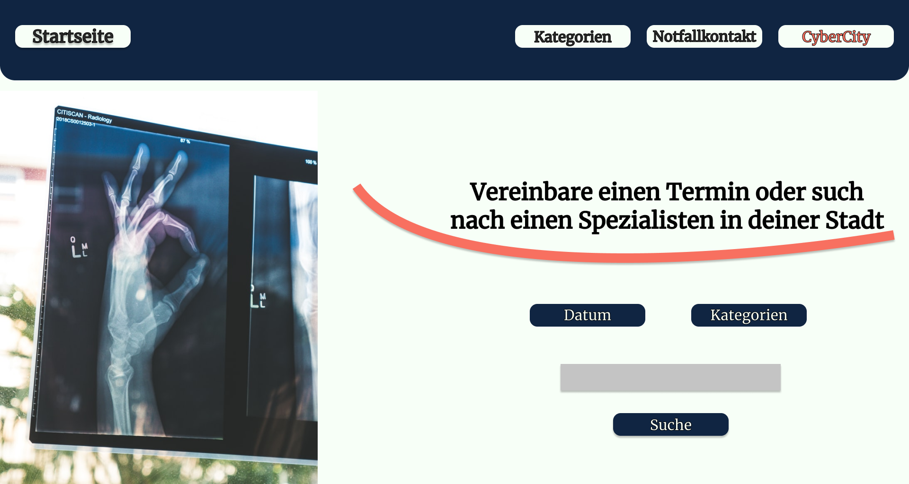
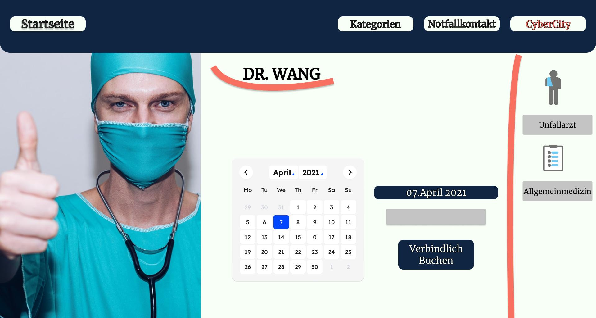

# Gesundheitswesen

**Autor:** Malte Theodor Kanders  
**URL:** http://gesundheitswesen.cyber-city.systems

## Überblick

- Textuelle Beschreibung der Anwendungsdomäne
  - Soll dem Bürger helfen die richtige Anlaufstelle für gesundheitliche Fragen
  zu finden.
  - Soll eine Sammelstelle für Relevante Daten sein, bspw. Notfallkontakte
  - Soll von Personen im Gesundheitssystem gefüllt werden. Diese können
  sich und ihr Angebot vorstellen.

## Funktionale Anforderungen

* Definition der Akteure
  - Bürger die nach Informationen/Kontaktmöglichkeiten suchen
  - Ärzte/Apotheken/Krankenhäuser/Therapeuten die sich vorstellen und eine Kontaktstelle
  bieten

  Use Cases des Microservices:
  

  Akteure:
    * Bürger
    * Gesundheitsexperten:
      * Apotheken
      * Krankenhäuser
      * Ärzte
      * Heilerzieungs....   

## Anforderungen im Detail

#### Haupt Template

| **Als** | **möchte ich** | **so dass** | **Akzeptanz** | **Priorität** |
| :------ | :----- | :------ | :-------- | :-------- |
| Benutzer| einen Home Button | ich immer schnell zum Start zurück finde | Im Hauptrand Segment ist ein Homebutton | Muss |
| Benutzer| einen Kategorien Button | ich schnell alle verfügbaren Kategorien sehen kann | Im Hauptrand ist ein Kategorien Button | Muss |
| Benutzer| einen Notfallkontakt Button | ich schnell alle Notfallkontakte sehen kann | Im Hauptrand ist ein Kategorien Button | Muss |
| Benutzer| einen CycberCity Button | ich schnell zurück zur Landingpage komme | Im Hauptrand ist ein LandingPage Button | Muss |

#### Startseite

| **Als** | **möchte ich** | **so dass** | **Akzeptanz** | **Priorität** |
| :------ | :----- | :------ | :-------- | :-------- |
| Benutzer| einen Suche | ich mich nicht durch die Seite klicken muss | die Suche ist auf der Startseite zu finden | Muss |
| Benutzer| einen Datumsbutton zur Suche | ich nur freie Termine oder Notfallkontakte im richtigen Zeitraum finden kann| zur Suche befindet sich ein Datumsbutton | Optional |
| Benutzer| Einen Kategorie Button | ich zwischen Notfallkontakten oder Kategorien auswählen kann | zur Suche befindet sich ein Button um Kategorien auswählen zu können | Optional |

#### Details

| **Als** | **möchte ich** | **so dass** | **Akzeptanz** | **Priorität** |
| :------ | :----- | :------ | :-------- | :-------- |
| Benutzer| ein Profil Bild des Arztes | ich mir ein erstes Bild machen kann | Profilbild | Muss |
| Benutzer| einen Kalender | an dem ich freie Tage zur Buchung finde | einen Kalender mit eingefärbten Tagen | Muss |
| Benutzer| einen Button um zwischen bestimmten Zeiten auswählen zu können | ich einen genauen Termin buchen kann | verfügbare Auswahltermine | Muss |
| Benutzer| am Rand dargestellt die Spezialgebiete des Spezialisten | ich weiß den richtigen Spezialisten zu haben | Liste aus Symbolen und Fachgebieten | Optional |

#### Such/ Kategorie/ Notfallkontakt Listenseite

| **Als** | **möchte ich** | **so dass** | **Akzeptanz** | **Priorität** |
| :------ | :----- | :------ | :-------- | :-------- |
| Benutzer| eine Liste mit den passenden Experten | ich alle relevanten Personen finde | Die passende Liste Personen | Muss |
| Benutzer| ein Button der zu dem Profil führt | ich zu dem richtigen Profil komme | Ein zum Profil führender Button | Muss |
| Benutzer| weitere Informationen der Experten | ich mehr Informationen habe | weitere Informationskästen | Optional |

#### Kategorien

| **Als** | **möchte ich** | **so dass** | **Akzeptanz** | **Priorität** |
| :------ | :----- | :------ | :-------- | :-------- |
| Benutzer| eine Sammlung an Kategorien | ich über diese Experten finden kann | eine "endliche" Menge an Kategorien | Muss |

## Graphische Benutzerschnittstelle

#### Startseite

#### Such/ Kategorie/ Notfallkontakt Listenseite

#### Kategorien

## Datenmodell

Vorläufige Skizze:

## Datenmodell

Vorläufige Skizze:

(## Abläufe

- Aktivitätsdiagramm für den Ablauf sämtlicher Use Cases
- Aktivitätsdiagramme für relevante Use Cases
- Aktivitätsdiagramm mit Swimlanes sind in der Regel hilfreich
  für die Darstellung der Interaktion von Akteuren der Use Cases / User Stories
- Abläufe der Kommunikation von Rechnerknoten (z.B. Client/Server)
  in einem Sequenz- oder Aktivitätsdiagramm darstellen
- Modellieren Sie des weiteren die Diagramme, die für das (eigene) Verständnis des
  Softwaresystems hilfreich sind.
)

## Schnittstellen

[Api Draft](media/api_draft.pdf)

### Commands / Events ?

| **Name** | **Parameter** | **Resultat** |
| :------ | :----- | :------ |
| createHealthExpert() | int x_id, timestamp x_date, x_name string, x_title string | int id |
| createCrewMember() | int crew_id, timestamp crew_date, crew_name string | int id |
| removeHealthExpert() | int id | int id |
| removeCrewMember() | int id | int id |
| createBreakingNews() | int n_id, string message | int id |

### Events

| **Name** | **Parameter** | **Resultat** |
| :------ | :----- | :------ |
| air_quality_waring_issues |  string message | string polution_type | string pollution_level | int id |
| daily_cultural_events_published |  string name | string location | string adress | string start | string end | int id |

## Technische Umsetzung

### Softwarearchitektur

- Darstellung von Softwarebausteinen (Module, Schichten, Komponenten)

* Server
  * Web-Schicht
    * KTor
  * Logik-Schicht
    * Kotlin/JVM
  * Persistenz-Schicht
    * PostgreSQL

* Client
  * View-Schicht
    * KVison(React)
  * Logik-Schicht
    * Kotlin/JS
  * Kommunikation-Schicht
    * KTor/KVision

##### FullStack WebAPP in der Gesamtübersicht:

##### Model UML:
Hier sollen alle Klassen die wie eine Daten Klasse operieren verlagert werden. So soll doppeltes schreiben und der Vorteil der durchgängigen Benutzung einer Sprache genutzt werden. Ebenso werden die Skripte zum erstellen der passenden Datenbank Tabellen abgelegt.

##### Backend UML:

##### Frontend UML
Nur kurze Idee, denn da noch kein Framework für das Frontend festgelegt wurde(KVision vs React) kann nicht genau die vorgehensweise bestimmt werden.
Erst muss über beide mehr Erfahrung gesammelt werden, KVision bisher präferiert da es ohne, oder fast ohne CSS und HTML auskommt.

### Fehlerbehandlung

* 200 -> OK
* 204 -> No Content
* 400 -> Bad Request *beispiel wäre, die Anfrage enthielt irgendwelche komischen nicht erwünschten zusätze*
* 403 -> Permission Denied
* 409 -> Conflict *beispielhaft: Zweimal die gleiche ID beim erstellen oder irgendwas als Unique gekennzeichnetes doppelt einfügen wollen.*
* 422 -> Unprocessable Entity *beispielhaft: Sehr wahrscheinliche eine kaputte und oder falsch formatierte JSON*
* default -> unexpected Error

( ### Validierung

* Relevante (Integrations)-Testfälle, die aus den Use Cases abgeleitet werden können
* Testfälle für
  - Datenmodell
  - API
  - User Interface
* Fokussieren Sie mehr auf Integrationstestfälle als auf Unittests
* Es bietet sich an, die IDs der Use Cases / User Stories mit den Testfällen zu verbinden,
  so dass erkennbar ist, ob Sie alle Use Cases getestet haben.)

### Verwendete Technologien

* Frontend
  * KVison/React
* Backend
  * KTor
* Datenbank
  * PostgreSQL
