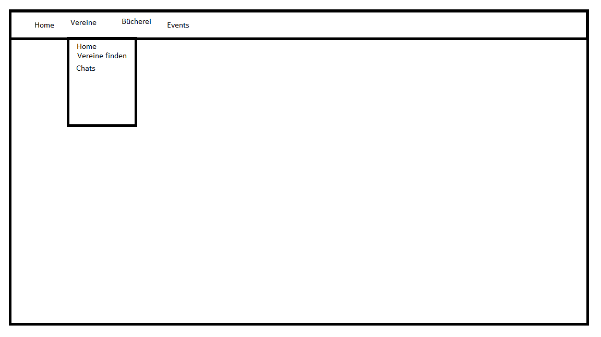

# Kultur

**Autor:** Mattis Fieseler


## Überblick

- Textuelle Beschreibung der Anwendungsdomäne
- Konzeptionelles Analyseklassendiagramm (logische Darstellung der Konzepte der Anwendungsdomäne)

Der Mikroservice Kultur stellt eine Verbindung zwischen Veranstaltern und Interessierten dar. Die Plattform soll dafür dienen einen Überblick über aktuelle Aktivitäten in der Umgebung zu bekommen oder das Interesse für die Mitarbeit in einem örtlichen Verein zu wecken. Außerdem kann über das Portal das aktuelle Inventar der Stadtbibliothek eingesehen, sowie den Status der Bücher abgefragt werden, sodass unnötige Besuche und langes Suchen verhindert werden kann. Des Weiteren Gibt es einen Lageplan alles öffentlichen Gebäude, sowie deren angebotenen Services. Außerdem soll durch Anbindung an den Wetter Mikroservice zu anstehenden Events eine Wettervorhersage einsehbar sein. Es gibt auf den Vereins Seiten die Möglichkeit mit anderen Mitgliedern zu schreiben. 

## Funktionale Anforderungen

* Definition der Akteure
* Use-Case Diagramme
* Strukturierung der Diagramme in funktionale Gruppen
* Akteure sowie andere Begriffe der implementierten Fachdomäne definieren 
* Begriffe konsistent in der Spezifikation verwenden  
* Begriffe im Glossar darstellen

Nutzer - auch User; Bürger, Studenten, Vereinsmitglieder, die interesse an der örtlichen Kultur haben
Veranstalter; Vereinsvorsitzende, Stadtbeamte
Event; Veranstaltung mit öffentlichem Interesse (z.B. Schützenfest, Sommerfest, Straßenfest, Stadtführung)

## Anforderungen im Detail

- User Stories mit Akzeptanzkritierien 
- Optional: Name (oder ID) und Priorität ("Must", "Should", "Could", "Won't")
- Strukturierung der User Stories in funktionale Gruppen
- Sicherheit: Misuse-Stories formulieren

| **Name**| **In meiner Rolle als**...|   ...**möchte ich**...   | ..., **so dass**... | **Erfüllt, wenn**... | **Priorität**   |
|:-----|:----------:|:-------------------|:-------------|:---------|:----------------|
|Melanie|Bürgerin| alle anstehenden Events auf einen Blick sehen können|immer auf dem neusten Stand bin und bei Interesse an Events teilnehmen kann| Liste von Events | Muss |
|Luca| Bücherwurm| schon von Zuhause sehen, ob die Stadtbücherei das neue Buch von Stephen King bereits hat|ich es mir ausleihen kann | suchbare Liste von verfügbaren Büchern |Muss|
|Mathias|Vorstand Schützenverein|den Termin für das Jährliche Schützenfest für alle Interessierten veröffentlichen|jeder der kommen möchte weiß, wann er stattfindet|Events hinzugefügt werden können|Muss|
|Felix|Hergezogener|alle Örtlichen Vereine sehen|ich einem Verein beitreten kann|Liste aller Vereine nach Interessengebiet sortiert|Muss|
|Vivien|Mitglied im Verein|mich mit den anderen Vereinsmitgliedern austauschen und auch außerhalb der Treffen mich austauschen|ich engeren Kontakt mit den andern Mitgliedern schließen kann|Gruppenchat Funktion|Kann|
|Marc|Leiter der Stadtbibliothek|neue Bücher online veröffentlichen|Interessenten schon vorher wissen, ob ein Buch verfügbar ist|Bücher zur Bücherliste hinzugefügt werden können|Sollte|
|Marc|Leiter der Stadtbibliothek|den Status von Büchern ändern (Ausgeliehen, Verfügbar, Bestellt)|Interessenten schon vorher wissen, ob ein Buch vor Ort ist|Status für Bücher ändern|Kann|


## Graphische Benutzerschnittstelle

- GUI-Mockups passend zu User Stories
- Screens mit Überschrift kennzeichnen, die im Inhaltsverzeichnis zu sehen ist
- Unter den Screens darstellen (bzw. verlinken), welche User Stories mit dem Screen abgehandelt werden
- Modellierung der Navigation zwischen den Screens der GUI-Mockups als Zustandsdiagramm
- Mockups für unterschiedliche Akteure

### Homepage der Kultur Seite


### Homepage der Verein Unterseite


### Dropdown zur Navigation in der Verein Unterseite


### Suchfunktion nach Vereinen


### Chat für Vereine


### Chat für Events


### Homepage der Bibliothek Unterseite


### Homepage der Stadtplan Unterseite


## Datenmodell 

- Begriffe im Glossar darstellen
- Modellierung des physikalischen Datenmodells 
  - RDBMS: ER-Diagramm bzw. Dokumentenorientiert: JSON-Schema


Datenbankmodell

## Abläufe

- Aktivitätsdiagramm für den Ablauf sämtlicher Use Cases
- Aktivitätsdiagramme für relevante Use Cases
- Aktivitätsdiagramm mit Swimlanes sind in der Regel hilfreich 
  für die Darstellung der Interaktion von Akteuren der Use Cases / User Stories
- Abläufe der Kommunikation von Rechnerknoten (z.B. Client/Server)
  in einem Sequenz- oder Aktivitätsdiagramm darstellen
- Modellieren Sie des weiteren die Diagramme, die für das (eigene) Verständnis des
  Softwaresystems hilfreich sind. 


## Schnittstellen

- Schnittstellenbeschreibung (API), z.B. mit OpenAPI 
- Auflistung der nach außen sichtbaren Schnittstelle des Microservices. Über welche Schnittstelle kann z.B. der Client den Server erreichen?
- In Event-gesteuerten Systemen ebenfalls die Definition der Ereignisse und deren Attribute
- Aufteilen in Commands, Events, Queries
* Abhängigkeiten: Liste mit Kommunikationsabhängigkeiten zu anderen Microservices


### URL

https://smart.city/kultur

### Commands

**Synchronous**

| **Name** | **Parameter** | **Resultat** |
| :------ | :----- | :------ |
| ```addEvent()``` | string name, timestamp time, string category | int id |
| ```updateBookStatus()``` | int id, string status | - |
| ```addBook()``` | sting title, string author, timestamp releaseDate | int id |

<!---
**Asynchronous**

| **Name** | **Parameter** | **Resultat** |
| :------ | :----- | :------ |
--->

### Events

**Customer event channel**

| **Name** | **Payload** | 
| :------ | :----- | 
| Event starts | int id |
| New Event | int id |

<!---
**Contract event channel**

| **Name** | **Payload** | 
| :------ | :----- | 
| Contract Received | int id |
| Contract Deleted | int id |
--->

### Queries

| **Name** | **Parameter** | **Resultat** |
| :------ | :----- | :------ |
| ```getEvents()``` | - | Event [] list |
| ```getEvent()``` | int id | Event e|
| ```getEvent()``` | string name | Event [] list |
| ```getClubs()``` | - | Club [] list |
| ```getClubs()``` | int id | Club c |
| ```getClubs()``` | string name | Club [] list |
| ```getBook()``` | - | Book [] list|
| ```getBook()``` | string searchterm | Book [] list|

<!---
### Dependencies

#### RPC

| **Service** | **Funktion** |
| :------ | :----- | 
| Authorization Service | authenticateUser() |
| Hospital Service | blockDate() |

#### Event-Subscriptions

| **Service** | **Funktion** |
| :------ | :----- | 
| Cinema channel | CancelFilmCreatedEvent |
| Customer reply channel | CreateCustomerEvent |
--->

## Technische Umsetzung


### Softwarearchitektur

- Darstellung von Softwarebausteinen (Module, Schichten, Komponenten)

Hier stellen Sie die Verteilung der Softwarebausteine auf die Rechnerknoten dar. Das ist die Softwarearchitektur. Zum Beispiel Javascript-Software auf dem Client und Java-Software auf dem Server. In der Regel wird die Software dabei sowohl auf dem Client als auch auf dem Server in Schichten dargestellt.

* Server
  * Web-Schicht
  * Logik-Schicht
    - Python
  * Persistenz-Schicht
    - MySql Datenbank Anbindung

* Client
  * View-Schicht
    - html
    - css
  * Logik-Schicht
    - JavaScript
  * Kommunikation-Schicht
    - Ajax 
    - JQuery

Die Abhängigkeit ist bei diesen Schichten immer unidirektional von "oben" nach "unten". Die Softwarearchitektur aus Kapitel "Softwarearchitektur" ist demnach detaillierter als die Systemübersicht aus dem Kapitel "Systemübersicht". Die Schichten können entweder als Ganzes als ein Softwarebaustein angesehen werden. In der Regel werden die Schichten aber noch weiter detailliert und in Softwarebausteine aufgeteilt. 


### Entwurf

- Detaillierte UML-Diagramme für relevante Softwarebausteine

### Fehlerbehandlung 

* Mögliche Fehler / Exceptions auflisten
* Fehlercodes / IDs sind hilfreich
* Nicht nur Fehler technischer Art ("Datenbankserver nicht erreichbar") definieren, sondern auch fachliche Fehler wie "Kunde nicht gefunden", "Nachricht wurde bereits gelöscht" o.ä. sind relevant. 

### Validierung

* Relevante (Integrations)-Testfälle, die aus den Use Cases abgeleitet werden können
* Testfälle für 
  - Datenmodell
  - API
  - User Interface
* Fokussieren Sie mehr auf Integrationstestfälle als auf Unittests
* Es bietet sich an, die IDs der Use Cases / User Stories mit den Testfällen zu verbinden,
  so dass erkennbar ist, ob Sie alle Use Cases getestet haben.

### Verwendete Technologien

- Verwendete Technologien (Programmiersprachen, Frameworks, etc.)

* Frontend
  - HTML
  - Bootstrap
  - CSS
  - JavaScript
  - Ajax
  - JQuery
* Backend
  - Python
  - REST API
* Datenbank
  - MySQL
