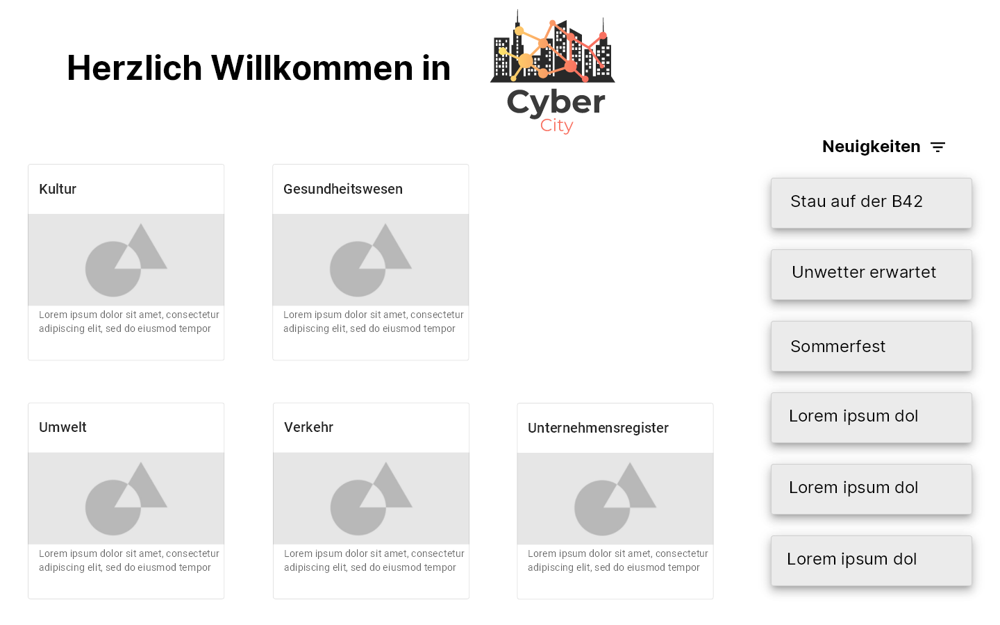
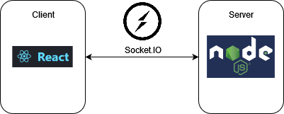
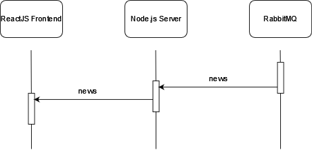

# Landing Page

**Autor:** Tim Bollmeyer  
**URL:** http://smart.city/microservices/landingpage

## Überblick

Die Landing Page stellt den Einstiegspunkt der ***CyberCity*** dar.  
In Kacheln werden die einzelnen Services unserer Stadt präsentiert, sodass jeder Bürger schnell das Gesuchte finden kann.
Neben der Verlinkung zu den einzelnen Microservices werden außerdem die aktuellen Nachrichten/Meldungen der Stadt angezeigt.

## Funktionale Anforderungen im Detail

| **Name**| **In meiner Rolle als**...|   ...**möchte ich**...   | ..., **so dass**... | **Erfüllt, wenn**... | **Priorität**   |
|:-----|:----------:|:-------------------|:-------------|:---------|:----------------|
| Service-Übersicht | Bürger | alle angebotenen Services der Stadt in einer Kachel-Übersicht sehen | ich alle Services gut überblicken kann | Alle Services werden in Kacheln angezeigt | Must |
| Microservice-Verlinkung | Bürger | über eine Kachel zum entsprechenden Service weitergeleitet werden | ich schnell auf einen gewünschten Service zugreifen kann | Korrekte Verlinkung auf jeweilige Microservices | Must |
| Kachel-Infos | Bürger | dass jede Kachel neben dem Namen des Services auch ein Bild und eine Beschreibung des Services enthält | der Zweck des Services deutlich wird | Bild + Beschreibung in jeder Service-Kachel | Should |
| Kachel-Positionierung | Bürger | ich die Kacheln nach Belieben positionieren können | ich die Startseite an meine Bedürfnisse anpassen kann | Drag & Drop der Kacheln | Could |
| News-Feed | Bürger | alle aktuellen Meldungen der Stadt sehen | ich auf dem Laufenden bleibe und bspw. auf Staumeldungen reagieren kann | News-Feed zeigt aktuelle Meldungen | Should |
| News-Filter | Bürger | die Meldungen filtern können | ich für mich relevante Meldungen schnell mitbekomme | Filter-Möglichkeiten für Meldungen (Thema, Datum etc.) | Could |

## Graphische Benutzerschnittstelle

## Datenmodell 

*entfällt*  
Die Landing Page zeigt die Kachel-Übersicht lediglich als statischen Inhalt an.  
Die für den News-Feed relevanten Events werden vom Server direkt an das Frontend gesendet, sodass auch für diesen Use-Case keine Notwendigkeit für eine Persistenz-Schicht samt Datenmodell entsteht.

## Technische Umsetzung

### Softwarearchitektur

Die technische Umsetzung der Landing Page ist recht simpel umgesetzt.  
Um die Neuigkeiten der Stadt darzustellen, ist eine Kommunikation vom Backend zum Frontend notwendig.
Dafür wird das Framework [Socket.IO](https://socket.io/) verwendet.
So kann der Server bei neuen Events über den RabbitMQ-Message-Bus diese Events an das React-Frontend senden.

### Schnittstellen

Die relevanten Events aus dem RabbitMQ-Message-Bus werden über die Socket.IO Schnittstelle lediglich eins-zu-eins an das Frontend weitergereicht.

