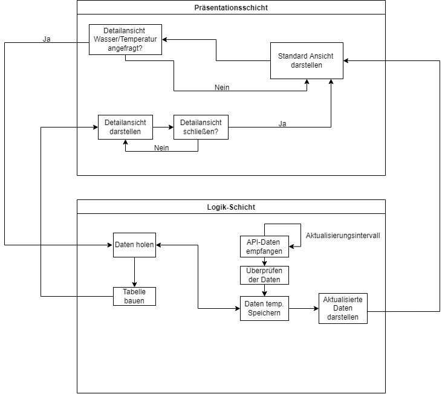
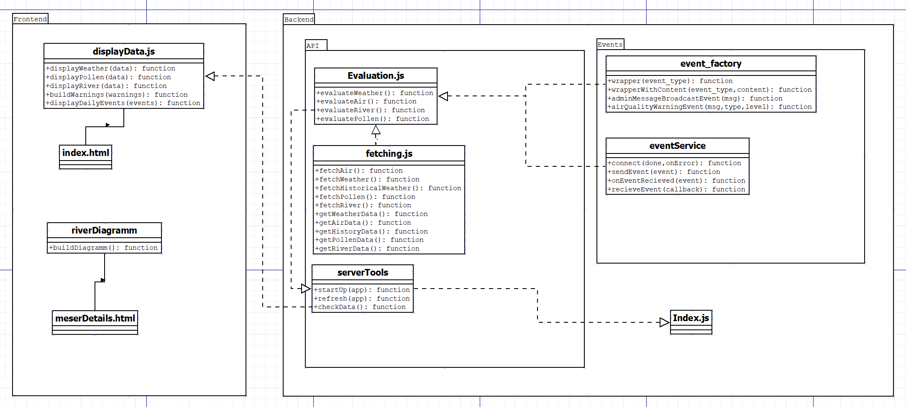

# Umwelt

**Autor:** Toni Schnittger  
**URL:** http://umwelt.cyber-city.systems

## Überblick

Im Microservice Umwelt sollen die Temperatur, die Luftreinheit, das Wetter, der Pollenflug sowie der Wasserstand des stadtnahen Flusses übersichtlich für verschiedene Stadtteile dargestellt werden. Außerdem sollen Veranstaltungen aus dem Bereich Kultur vorgeschlagen werden.
Wichtig sollte dazu noch eine Warnung zu bevorstehenden Wetterverhältnissen wie z.B. Stürme, Hochwasser oder Hitze sein. Der Microservice soll die Nutzer mit allem verbinden was Umwelttechnisch in der Stadt passiert. Falls dieser Microservice entgegen der Erwartung sehr früh fertig gestellt werden sollte, würden weiterhin noch eine Funktion für Umwelt-tipps (z.B. für Bewässerung von Pflanzen entsprechend des Grundwasserspiegels) implementiert werden.

## Funktionale Anforderungen

Akteure: Alle Bürger oder Touristen mit Interesse an der Umwelt, APIs

**Use-Case**

## Anforderungen im Detail

**User Stories**

| **Als** | **möchte ich** | **so dass** | **Erfüllt, wenn** | **Priorität**   |
| :------ | :----- | :------ | :-------- | :-------- |
| Sportler | wissen, ob es heute regnet | ich nicht vom Regen überrascht werde | Wetter für den Rest des Tages angezeigt wird | Must |
| Allergiker | wissen welche Pollen-Arten fliegen | ich weiß, ob ich Medikamente nehmen muss | Anzeige für Pollenflug/Arten | Must |
| Angler | den Wasserstand erfahren | ich weiß, ob ich Angeln gehen kann | Wasserstand anzeige | Must |
| Tourist | das Wetter für nächste Woche sehen | ich den Zeitraum meines Ausflugs planen kann | Vorhersage anzeige funktioniert | Must |
| Bürger | das Wetter der letzten Woche sehen | ich die Entwicklung verfolgen kann | Letzte 5 Tage anzeige funktioniert | should |
| Bootbesitzer | Alle aktuellen Daten zum Fluss erfahren | sicher fahren kann | Detail anzeige der Flussdaten | could |

## Graphische Benutzerschnittstelle

**Wetter Startseite**

**Buttons zum Ansehen von späterem Wetter**

**Button zum Anzeigen genauerer Wasserstands Informationen**

**Die Temperatur der letzten Tage im Diagramm**

## Abläufe

* Backend:
  - Daten werden allesamt jede Stunde(xx:00 Uhr) neu gefetched
  - Um 8 Uhr Morgens und Abends werden zusätzlich die Daten neu ausgewertet, was neue Events sendet und die Warnungen aktualisiert
  - Die aktuellen Daten sind über /getAllData für das Frontend abrufbar

* Frontend:
  - Die Daten werden jede Stunde(xx:01 Uhr) oder wenn die Seite neu aufgerufen wird über /getAllData geholt und die Seite wird refreshed
  
## Schnittstellen

### API

#### Wetter

Wetter, UV-Level, etc.: Openweathermap(https://openweathermap.org/api) 
Mit Openweathermap wird der Großteil der Informationen für die Wetter Seite dargestellt. Sie liefert die Temperatur, das Wetter, die Windgeschwindigkeit, die Gefühlte Temperatur, die Luftverschmutzung und mehr für Mehrere Tage im Voraus. 

#### Wasserstand

Wasserstand: Pegelonline(https://www.pegelonline.wsv.de/webservice/dokuRestapi)
Pegelonline liefert den Wasserstand und viele andere Daten, wovon die meisten Jedoch uninteressant für User wären, weswegen wir hier nur das Wichtigste darstellen. 
Die Aktualisierung des Wasserstands, wird wahrscheinlich ein Mal pro Stunde stattfinden(Bei Hochwassergefahr ggf. öfter).

#### Pollen

Pollen: Pollen Forecast API (https://achoo.dev/)
Pollen Forecast API liefern viele Daten über den Flug der verschiedenen Arten für jeden Bereich von Deutschland. 
Da die Daten der Pollen API nur täglich aktualisiert werden, wird diese Anzeige auch einmal täglich, oder wenn technisch nötig aktualisiert.  

#### Schnittstelle zum Frontend

Die Evaluierten und überprüften Daten werden über "/api/getAllData" an das Frontend gesendet. 

### Commands

| **Name** | **Parameter** | **Resultat** |
| :------ | :----- | :------ |
| getPollen() | - | JSON pollendata |
| getRiver() | - | JSON riverdata|
| buildRiverTable() | - | boolean result |
| getWeather() | - | JSON weatherdata |
| getWeather() | int hour | JSON weatherdata |
| getWeather() | date day | JSON weatherdata |
| buildWeatherTable() | - | boolean result |

#### Events

| **Service** | **Funktion** | **Wofür |
| :------ | :----- | :----- |
| Kultur | getDailyEvents | Die Täglichen Veranstaltungen darstellen |
| Umwelt | air_quality_warning_event | Nenneswerte Umweltdaten wie z.B. schlechte Luftqualität senden |

## Technische Umsetzung

### Softwarearchitektur

- Darstellung von Softwarebausteinen (Module, Schichten, Komponenten)

* Server
  * Web-Schicht
    - express.js
  * Logik-Schicht
    - Javascript 

* Client
  * View-Schicht
    - HMTL
    - CSS
  * Logik-Schicht
    - Javascript

(Der Aktualisierungsintervall ist hier der im Abschnitt Abläufe beschriebene Intervall von einer Stunde)

### Entwurf

**UML**

### Fehlerbehandlung/Validierung 

Mögliche fehler begrenzen sich hier auf nicht erreichen der API, oder fehlerhaften Events der anderen Microservices. Sollte eine der APIs nicht erreichbar sein, werden die Daten nicht an die Evaluation und das Frontend weitergeleitet. Das Frontend benutzt weiter die letzten korrekten Daten, diese reichen noch für mindestens 24H in die Zukunft. Das Fetching wird eine Stunde später erneut versucht. 

### Verwendete Technologien

- Verwendete Technologien (Programmiersprachen, Frameworks, etc.)

* Frontend
  - HTML
  - CSS
* Backend
  - Javascript
  - Express.JS
  - Node.js
* Datenbank
