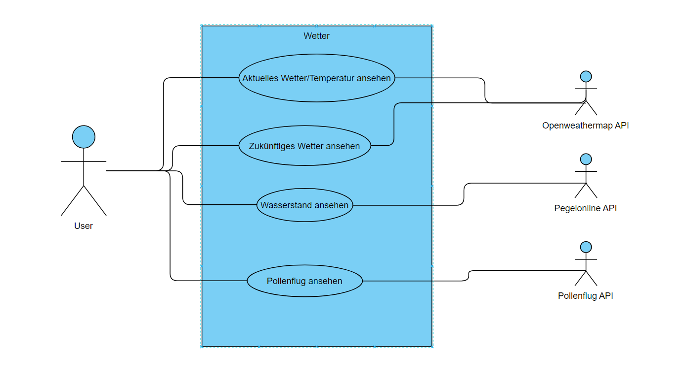
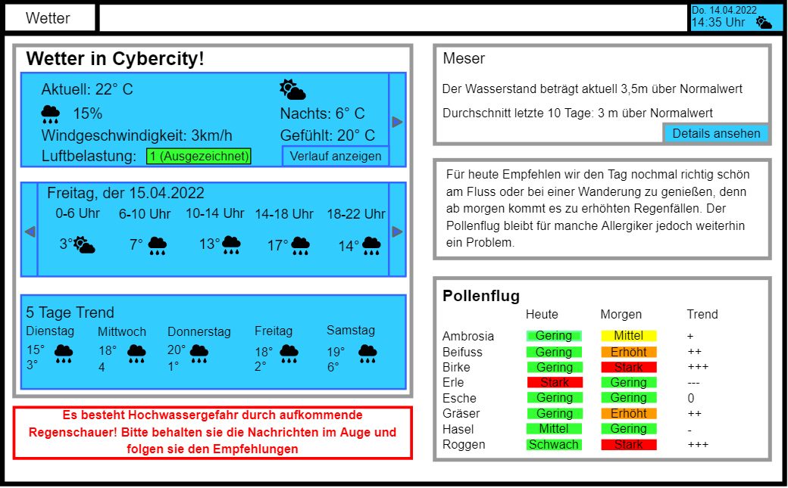
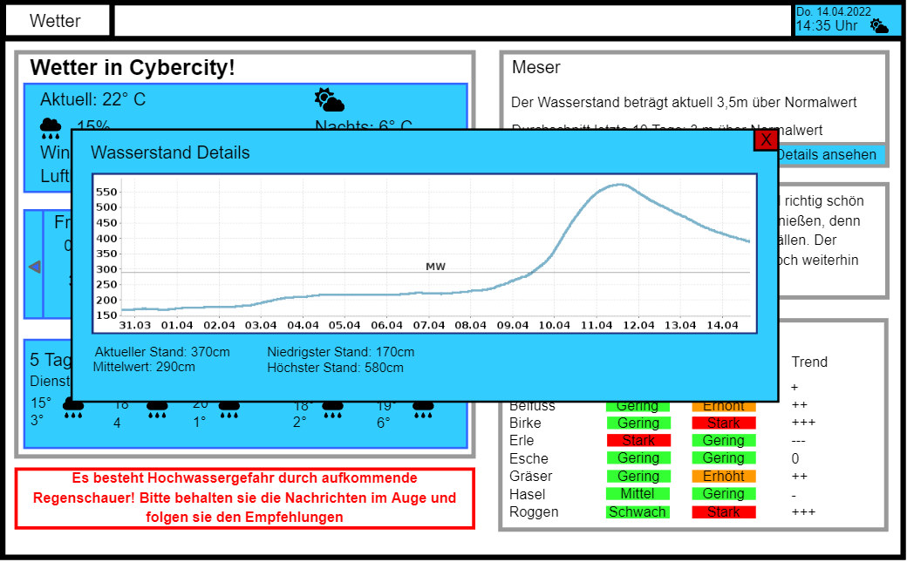
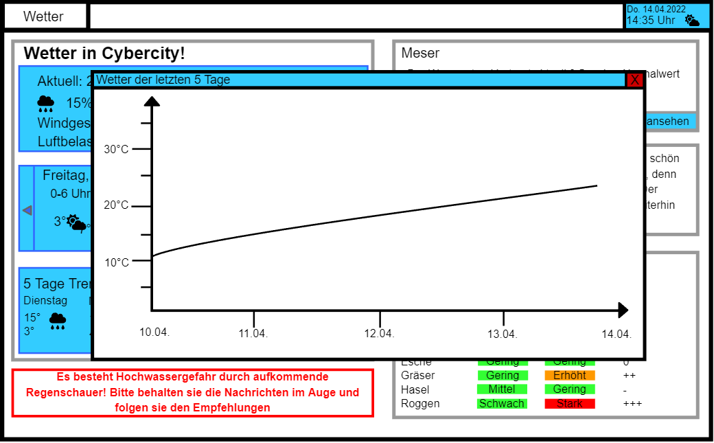
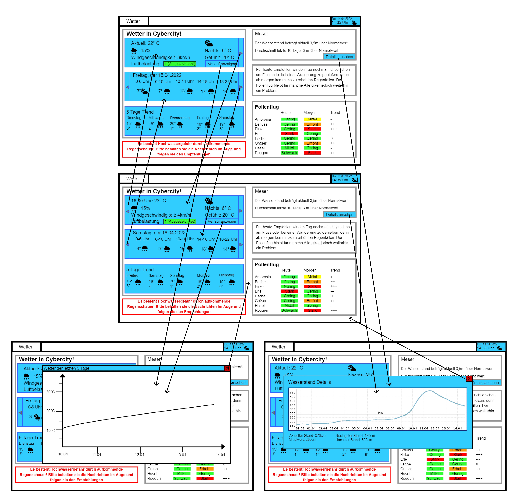
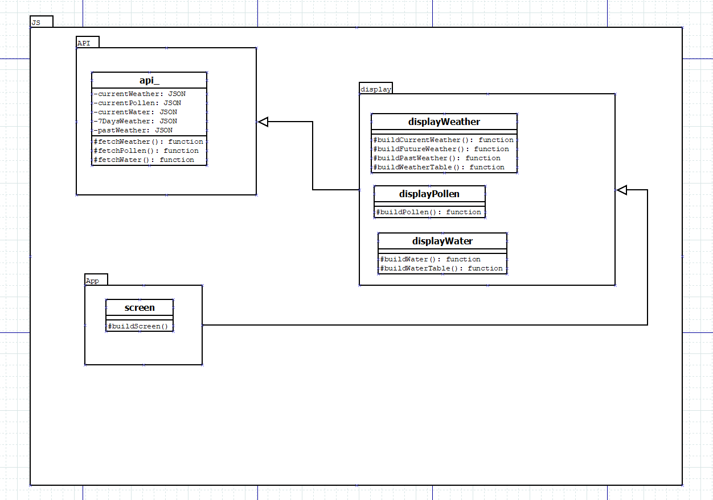

# Umwelt

**Autor:** Toni Schnittger

## Überblick

Im Microservice Umwelt sollen die Temperatur, die Luftreinheit, das Wetter, der Pollenflug sowie der Wasserstand des stadtnahen Flusses übersichtlich für verschiedene Stadtteile dargestellt werden. Außerdem sollen passend zu den Verhältnissen Aktivitäten wie z.B. Radfahren oder Veranstaltungen aus dem Bereich Kultur vorgeschlagen werden.
Wichtig sollte dazu noch eine Warnung zu bevorstehendem Extremwetter wie Stürme oder Hochwasser sein. Der Microservice soll die Nutzer mit allem verbinden was
Umwelttechnisch in der Stadt passiert. Falls dieser Microservice entgegen der Erwartung sehr früh fertig gestellt werden sollte, würden weiterhin noch eine Funktion für Umwelt-tipps (z.B. für Bewässerung von Pflanzen entsprechend des Grundwasserspiegels) implementiert werden.

## Funktionale Anforderungen

Akteure: Alle Bürger oder Touristen mit Interesse am Wetter, APIs

**Use-Case**

## Anforderungen im Detail

**User Stories**

| **Als** | **möchte ich** | **so dass** | **Erfüllt, wenn** | **Priorität**   |
| :------ | :----- | :------ | :-------- | :-------- |
| Sportler | wissen, ob es heute regnet | ich nicht vom Regen überrascht werde | Wetter für den Rest des Tages angezeigt wird | Must |
| Allergiker | wissen welche Pollen-Arten fliegen | ich weiß, ob ich Medikamente nehmen muss | Anzeige für Pollenflug/Arten | Must |
| Angler | den Wasserstand erfahren | ich weiß, ob ich Angeln gehen kann | Wasserstand anzeige | Must |
| Tourist | das Wetter für nächste Woche sehen | ich den Zeitraum meines Ausflugs planen kann | Vorhersage anzeige funktioniert | Must |
| Bürger | das Wetter der letzten Woche sehen | ich die Entwicklung verfolgen kann | Letzte 5 Tage anzeige funktioniert | should |
| Bootbesitzer | Alle aktuellen Daten zum Fluss erfahren | sicher fahren kann | Detail anzeige der Flussdaten | could |

## Graphische Benutzerschnittstelle

**Wetter Startseite**

**Buttons zum Ansehen von Späterem Wetter**

**Button zum Anzeigen genauerer Wasserstands Informationen**

**Die Temperatur der letzten Tage im Diagramm**

## Datenmodell 

Eine Datenbank wird für den Wetter Microservice nicht benötigt, da die Vergangenen Wetterdaten ebenfalls über die API verfügbar sind.

## Abläufe

  **Funktionen der Buttons**

  

## Schnittstellen

###API

####Wetter

Wetter, UV-Level, etc.: Openweathermap(https://openweathermap.org/api) 
Mit Openweathermap wird der Großteil der Informationen für die Wetter Seite dargestellt. Sie liefert die Temperatur, das Wetter, die Windgeschwindigkeit, die Gefühlte Temperatur, die Luftverschmutzung und mehr für Mehrere Tage im Voraus. 
Die Gratisversion von Openweathermap beschränkt die aufrufe auf 60/Minute. Wir werden die Aktualisierung entsprechend anpassen müssen, geplant ist im Normalfall alle 15 Minuten (Bei gefährlichem Wetter ggf. öfter). 

####Wasserstand

Wasserstand: Pegelonline(https://www.pegelonline.wsv.de/webservice/dokuRestapi)
Pegelonline liefert den Wasserstand und viele andere Daten, wovon die meisten Jedoch uninteressant für User wären, weswegen wir hier nur das Wichtigste darstellen. 
Die Aktualisierung des Wasserstands, wird wahrscheinlich ein Mal pro Stunde stattfinden.

####Pollen

Pollen: Pollen Forecast API (https://achoo.dev/)
Pollen Forecast API liefern viele Daten über den Flug der verschiedenen Arten für jeden Bereich von Deutschland. 
Da die Daten der Pollen API nur täglich aktualisiert werden, wird diese Anzeige auch einmal täglich, oder wenn technisch nötig aktualisiert.  

### URL

http://smart.city/microservices/umwelt

### Commands

| **Name** | **Parameter** | **Resultat** |
| :------ | :----- | :------ |
| getPollen() | - | JSON pollendata |
| getRiver() | - | JSON riverdata|
| buildRiverTable() | - | boolean result |
| getWeather() | - | JSON weatherdata |
| getWeather() | int hour | JSON weatherdata |
| getWeather() | date day | JSON weatherdata |
| buildWeatherTable() | - | boolean result |

#### Event-Subscriptions

| **Service** | **Funktion** |
| :------ | :----- | 
| Kultur | getDailyEvents |

## Technische Umsetzung

### Softwarearchitektur

- Darstellung von Softwarebausteinen (Module, Schichten, Komponenten)

Hier stellen Sie die Verteilung der Softwarebausteine auf die Rechnerknoten dar. Das ist die Softwarearchitektur. Zum Beispiel Javascript-Software auf dem Client und Java-Software auf dem Server. In der Regel wird die Software dabei sowohl auf dem Client als auch auf dem Server in Schichten dargestellt.

* Server
  * Web-Schicht
  * Logik-Schicht
    - Javascript 
  * Persistenz-Schicht

* Client
  * View-Schicht
    - HMTL
    - CSS
  * Logik-Schicht
    - Javascript
  * Kommunikation-Schicht

Die Abhängigkeit ist bei diesen Schichten immer unidirektional von "oben" nach "unten". Die Softwarearchitektur aus Kapitel "Softwarearchitektur" ist demnach detaillierter als die Systemübersicht aus dem Kapitel "Systemübersicht". Die Schichten können entweder als Ganzes als ein Softwarebaustein angesehen werden. In der Regel werden die Schichten aber noch weiter detailliert und in Softwarebausteine aufgeteilt. 

(Der Aktualisierungsintervall ist hier der im Abschnitt Abläufe beschriebene Intervall pro API)

### Entwurf

Aufgrund von mangelnder Erfahrung in den benutzten Programmiersprachen bzw. Webentwicklung ist das UML hier grob gehalten, da ich mich erst in die Materie hineinarbeite.

**Javascript API-Einbindung und Darstellung**

**Serverseite**

Von der Serverseite aus gestaltet sich das Anfertigen eines UMLs noch schwierig, da ich mich um die beste Lösung zu finden noch weiter in die Materie hineinarbeiten muss. 

### Fehlerbehandlung 

* Mögliche Fehler / Exceptions auflisten
* Fehlercodes / IDs sind hilfreich
* Nicht nur Fehler technischer Art ("Datenbankserver nicht erreichbar") definieren, sondern auch fachliche Fehler wie "Kunde nicht gefunden", "Nachricht wurde bereits gelöscht" o.ä. sind relevant. 
* Server einer API sind nicht erreichbar

200 --> OK

204 --> No Content

422 --> Unprocessable Entity (Bsp.: Eine fehlerhafte/falsch formatierte JSON)

### Validierung

Da der Microservice nur darstellt beschränken sich mögliche Fehler auf die API und deren Darstellung. Getestet wird hier also für fehlerhafte API daten und fehlerhafte Verarbeitung/Darstellung

### Verwendete Technologien

- Verwendete Technologien (Programmiersprachen, Frameworks, etc.)

* Frontend
  - REACT
* Backend
  - REST API
  - Javascript
* Datenbank
