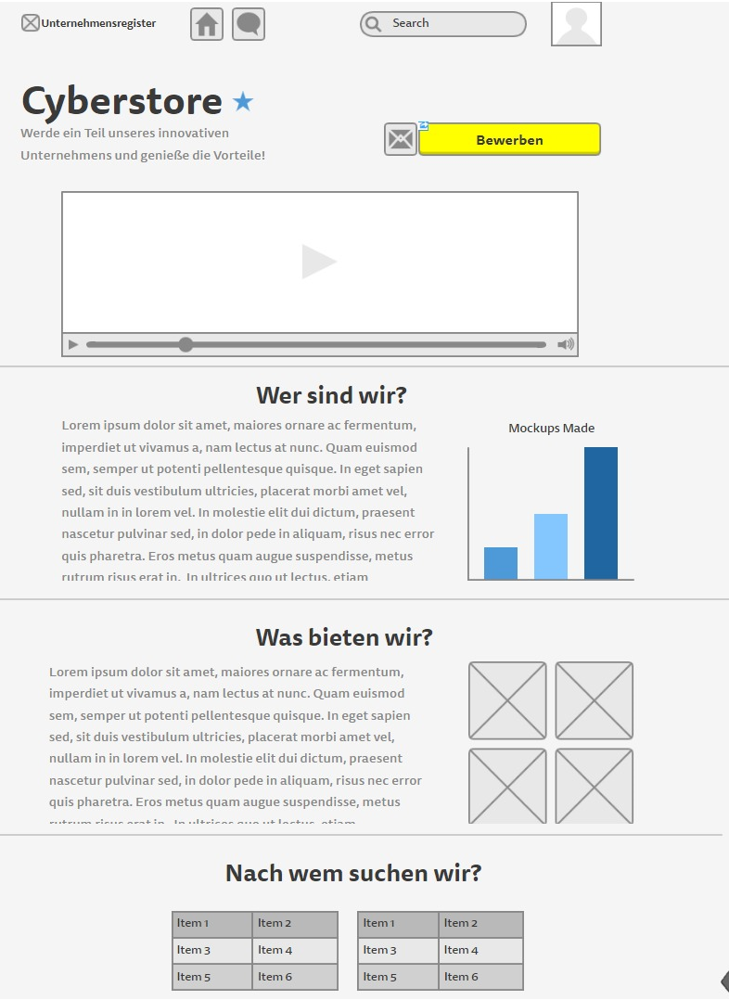
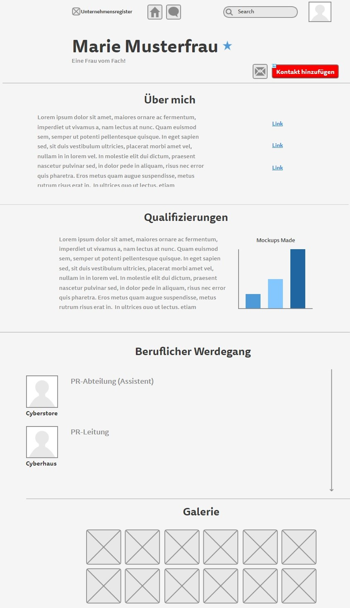
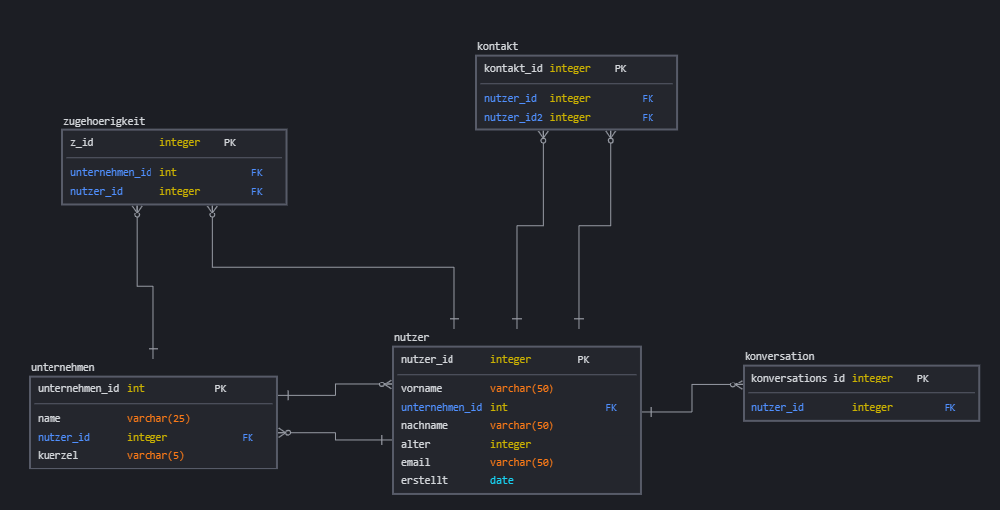

# Unternehmensregister

**Autor:** Clemens Maas

## Überblick

Der Mikroservice "Unternehmensregister" ist eine Schnittstelle von Bürgern und registrierten Unternehmen.
Er bietet Mitgliedern die Möglichkeit sich über ein Profil darzustellen, und sich über das Stellenportal bei interessanten Firmen zu bewerben, um so einen Job zu ergattern. Unternehmen dagegen wird eine Plattform geboten, sich auf dem Arbeitsmarkt zu präsentieren und Besetzungslücken mit qualifiziertem Personal zu schließen.

Über Profile kann die gesamte professionelle Laufbahn abgebildet werden, aber auch Kontakte geknüpft werden.
So wird neben dem professionellen Bereich auch ein sozialer Aspekt geboten.

## Funtionale Anforderungen
//?

### Anforderungen im Detail

| **Als** | **möchte ich** | **so dass** | **Akzeptanz** |
| :------ | :----- | :------ | :-------- |
| Wer | Was | Warum | Wann akzeptiert |

| **Als** | **möchte ich** | **so dass** | **Akzeptanz** |
| :------ | :----- | :------ | :-------- |
| Unternehmen | mich präsentieren | Ich attraktiv wirkte | Profilseite |
| Unternehmen | Bewerbungen bekommen können |  | Bewerbungsmanager |
| Bürger | mich präsentieren | ich bei Unternehmen punkten kann | Profilseite |
| Bürger | mich bewerben können | ich einen Job finden kann | Stellenmarkt |
| Bürger | soziale Kontakte pflegen können | ich meinen professionellen Raum erweitern kann | Social Hub |

## Grafische Benutzerschnittstellen
#### Profil von Unternehmen

#### Profil von Nutzern

## Datenmodell
*Relations sind scuffed, nur grob*

## Abläufe
//TODO

## Schnittstellen

### URL
http://cyber.city/unternehmensregister

### Commands
//TODO

### Events
//TODO

### Queries
//TODO

### Dependencies
//TODO

#### RPC
//TODO

#### Event-Subscriptions
//TODO

## Technische Umsetzung

### Softwarearchitektur
//TODO

### Entwurf
//TODO

### Fehlerbehandlung
//TODO

### Validierung
//TODO

### Verwendete Technologien

* Tools
	- PS7
	- Git
	- NeoVim
	- Datagrip
	- IntelliJ
	- Bootstrap Studio
* Frontend
	- HTML
	- CSS
	- Bootstrap 5
	- JavaScript (JQuery, Ajax)
* Backend
	- Java / Kotlin
	- Spring
* Datenbank
	- PostgreSQL
