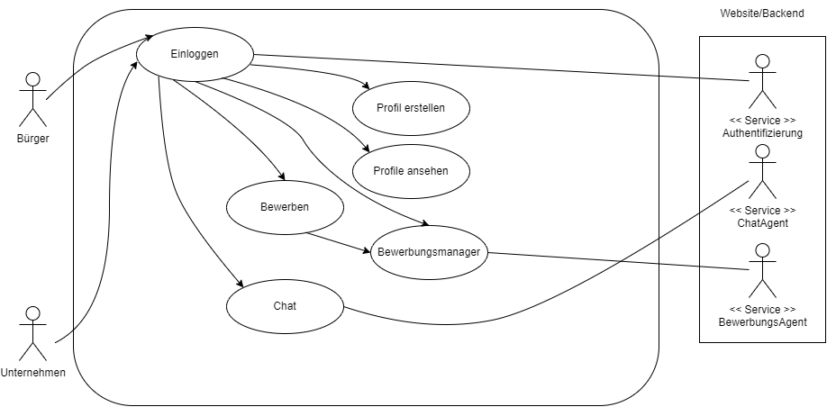
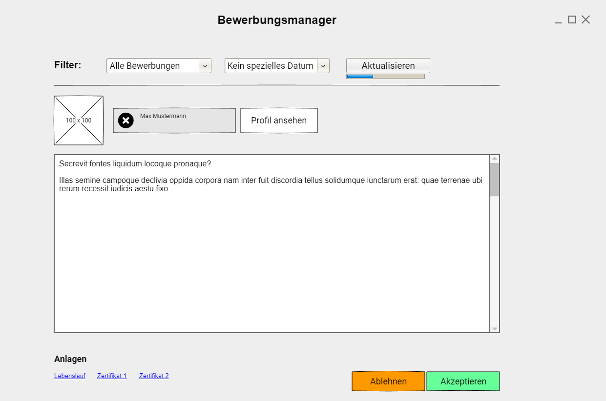

# Unternehmensregister

**Autor:** Clemens Maas

## Überblick

Der Mikroservice "Unternehmensregister" ist eine Schnittstelle von Bürgern und registrierten Unternehmen.
Er bietet Mitgliedern die Möglichkeit sich über ein Profil darzustellen, und sich über das Stellenportal bei interessanten Firmen zu bewerben, um so einen Job zu ergattern. Unternehmen dagegen wird eine Plattform geboten, sich auf dem Arbeitsmarkt zu präsentieren und Besetzungslücken mit qualifiziertem Personal zu schließen.

Über Profile kann die gesamte professionelle Laufbahn abgebildet werden, aber auch Kontakte geknüpft werden.
So wird neben dem professionellen Bereich auch ein sozialer Aspekt geboten.

## Funktionale Anforderungen
* Bürger: Leute die nach einem Job suchen oder im Arbeitsumfeld Kontakte knüpfen wollen.
* Unternehmen: Firmen die nach neuen Mitarbeitern suchen und sich präsentieren wollen.

### Anforderungen im Detail

| **Als** | **möchte ich** | **so dass** | **Akzeptanz** |
| :------ | :----- | :------ | :-------- |
| Wer | Was | Warum | Wann akzeptiert |

| **Als** | **möchte ich** | **so dass** | **Akzeptanz** |
| :------ | :----- | :------ | :-------- |
| Unternehmen | mich präsentieren | Ich attraktiv nach außen wirke | Profilseite |
| Unternehmen | Stellenanzeigen veröffentlichen | Leute auf die Stelle aufmerksam werden | Stellenmarkt |
| Unternehmen | Bewerbungen bekommen können | Ich Mitarbeiter einstellen | Bewerbungsmanager |
| Bürger | mich präsentieren | ich bei Unternehmen punkten kann | Profilseite |
| Bürger | meine Laufbahn zeigen | man meine Expertise nachverfolgen kann | Profil -> Laufbahn |
| Bürger | Fotos hochladen | ich mehr von mir zeigen kann | Profil -> Gallery |
| Bürger | Zertifikate ausstellen können | Ich meine Qualitäten darstellen kann | Profil -> Expertise |
| Bürger | mich bewerben können | ich einen Job finden kann | Stellenmarkt |
| Bürger | soziale Kontakte pflegen können | ich meinen professionellen Raum erweitern kann | Social Hub |
| Bürger | Nachrichten schreiben können | keine externen Tools zur Kommunikation brauche | Chat |

## Grafische Benutzerschnittstellen
#### Profil von Unternehmen

#### Profil von Nutzern

#### Bewerbungsmanager

#### Stellenmarkt

## Datenmodell
*Relations sind scuffed, nur grob*

## Abläufe
//TODO

## Schnittstellen

### URL
http://cyber.city/unternehmensregister

### Commands
**Synchronous**
| **Name** | **Parameter** | **Resultat** |
| :------ | :----- | :------ |
| addCompany | id: integer | 'success |
| deleteCompany | id: int | 'success' |
| addUser | id: int | 'success' |
| deleteUser | id: int | 'success' |

**Asynchronous**
| **Name** | **Parameter** | **Resultat** |
| :------ | :----- | :------ |
| newContact | id_user1: int, id_user2: int | 'success |
| deleteContact | id_user1: int, id_user2: int | 'success |
| newEmployee | id_company: int, id_user: int | 'success |
| removeEmployee | id_company: int, id_user: int | 'success' |

### Events

*Eventuell nicht benötigt da -> REST API*
| **Name** | **Payload** |
| :------ | :----- |
| newWorker | Infos des neu eingestellen ÖPNV Mitarbeiters |
| removedWorker | Infos des abgesprungen Mitarbeiters |

## Technische Umsetzung

### Softwarearchitektur
* Server
  * Web-Schicht
	* Spring
  * Logik-Schicht
	* Java
	* Spring
  * Persistenz-Schicht
	* PostgreSQL

* Client
  * View-Schicht
	* CSS
	* HTML
	* Bootstrap 5
  * Logik-Schicht
	* JavaScript
  * Kommunikation-Schicht
	* JavaScript

### Entwurf
//TODO

### Fehlerbehandlung
* API Response Codes:
	* 200 [Ok]
	* 400 [Bad Request]

### Validierung
//TODO

### Verwendete Technologien

* Tools
	- PS7
	- Git
	- NeoVim
	- Datagrip
	- IntelliJ
	- Bootstrap Studio
* Frontend
	- HTML
	- CSS
	- Bootstrap 5
	- JavaScript (JQuery, Ajax)
* Backend
	- Java / Kotlin
	- Spring
* Datenbank
	- PostgreSQL
