# Verkehr 

**Autor:** Jonas vom Braucke  
**URL:** http://verkehr.cyber-city.systems

## Überblick

	In der Domäne Verkehr werden grundsätzlich alle Inhalte der Personen-Fortbewegung festgehalten.
	Dies betrifft in unserer CyberCity den Status der Parkplätze und Ladesäulen,
	die Addressen von Tankstellen und aktuelle Preise suchen,
	Addressen und Kontaktinformationen von Werkstätten einsehen,
	Informationen zum öffentlichen Nahverkehr mit Bus und Bahn erhalten, 
	Stau- und Unfallinformationen erhalten und Aktuell halten, 
	so wie über den aktuellen Status und Informationen zu der Planung von Bauvorhaben auf allen öffentlichen Wegen & Straßen zu erhalten.

## Funktionale Anforderungen

**Akteure:**

	- Verkehrsteilnehmer
	- Öffentlicher Personen Nahverkehr & dessen Nutzer
	- Bus & Bahn Fahrer
	- Polizei
	- Feuerwehr
	- Krankenwagen
	- Nachichtendienste (Radio, Fernsehsender, Zeitungen)

**Use-Case Diagramme**

* Normale Nutzer:

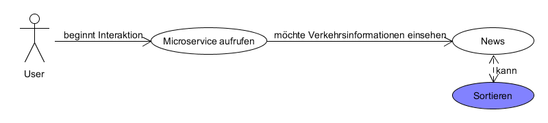
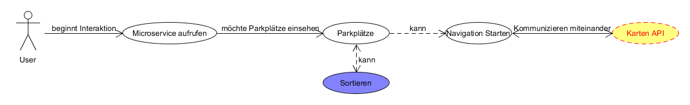
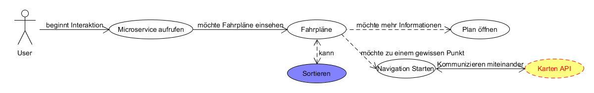
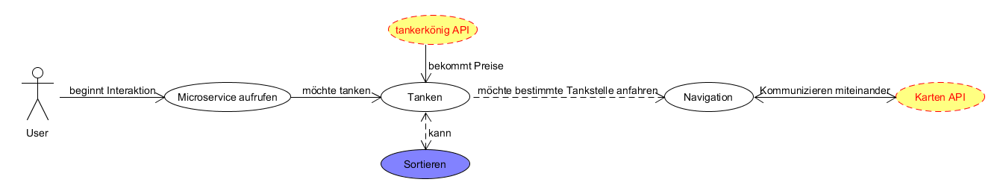
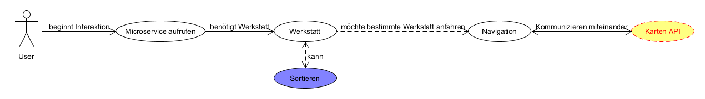

* Nutzer mit Sonderrechten:

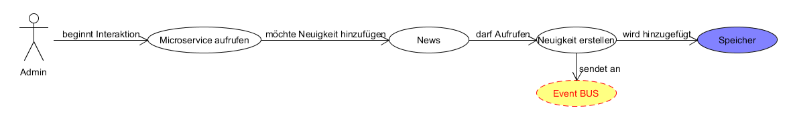
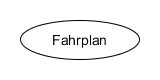

**Glossar:**

	- News: Die Zusammengestellten Daten von Verkehrsunfällen und Bauarbeiten 
	- Admin: temporäre Definition von Nutzern mit Sonderfunktionsrechten
	- Navi: Darstellung eines Ortes auf einer Karte, kann auch eine Routenfunktion beinhalten
	- ÖPNV: Öffentlicher Personen Nahverkehr

## Anforderungen im Detail

**User Stories**

| **Name**| **In meiner Rolle als**...|   ...**möchte ich**...   | ..., **so dass**... | **Erfüllt, wenn**... | **Priorität**   |
|:-----|:----------:|:-------------------|:-------------|:---------|:----------------|
| Nachichten  | Reporter/in | wissen welche Unfälle wann passiert sind | ich darüber Berichten kann | Neuigkeiten angezeigt werden | Muss |
| Neuigkeiten Berichten | Polizist/in | über eine Sperrung informieren können | sie umfahren werden kann | die Verkehrsteilnehmer informiert sind | Muss |
| Parkauskunft | Autofahrer/in | wissen wo Parkplätze frei sind | ich mein Auto abstellen kann | ich sehen kann, welche Plätze frei sind | Muss |
| Parkplatz Informationen | Event Besucher/in | wissen welche Parkplätze wo verfügbar sind | ich Parkmöglichkeiten vergleichen kann | ich einsehen kann wie die Auswahl der Plätze ist | Sollte|
| Ladestationen | Elektro Auto Besitzer/in | mich über mögliche Ladesäulenplätze informieren | ich mein Auto laden kann | ich den Status der Ladesäulen einsehen kann| Muss |
| Parkplatz Finder | Autofahrer/in | einen Parkplatz finden | ich dort Parken kann | die Navigatoin mich zu einem Parkplatz führt | Sollte |
| Fahrpläne | Student/in | wissen wie ich von A nach B mit dem Bus komme | ich nicht den ganzen Weg laufen muss | ich sehen kann welchen Bus ich nehemen muss | Muss|
| Haltestellen Finden | Ortsfremde/r | erfahren wo die passende Haltestelle ist | ich nicht ewig dannach suchen muss | ich eine Wegbeschreibung erhalte | Sollte |
| Arbeitszeiten | Bahnfahrer/in | wissen wann und wo meine Schicht beginnt | ich pünktlich und am richtigen Ort meine Schicht beginnen kann | ich meinen Artbeitsplan einsehen kann | Muss |
| Spritpreise Finden | Autofahrer/in | sehen wo ich für welchen Spritpreis ich tanken kann | mein Auto nicht leer ist und ich nicht zu viel zahle | mir die möglichen Tankstellen angezeigt werden | Muss |
| Tankstelle Finden | Ortsfremde/r | die nächste Tankstelle finden | ich nicht planlos umher Fahre und suche | mir eine Wegbeschreibung gegeben wird | Sollte |
| Spritpreise Vergleichen | Spaarfuchs | sehen an welcher Tankstelle ich am günstigsten tanken kann | ich Geld spaare | ich eine Übersicht der Preise bekomme | Könnte |
| Werkstatt Finden | Autofahrer/in | eine Werkstatt finden | Reperaturen an meinem Auto durchführen lassen kann | mir mögliche Werkstätte angezeigt werden | Muss |
| Werkstatt Informationen | Tuner/in | mich über eine Werkstatt informieren | ich mein Auto zur richtigen Werkstatt bringen kann | ich weitere Informationen zu einer Werkstatt einsehen kann | Könnte |
| Werkstadt Aufsuchen | Autofahrer/in | den Weg zu einer Werkstatt wissen | ich diese aufsuchen kann | mir eine Wegbeschreibung gegeben wird | Sollte |
| KFZ/-Notfall | Verunfallte/r | herausfinden wie die Telefonnummer eines Abschleppdienstes ist | ich mein KFZ in eine Werkstatt bringen kann | mir die Telefonnummer angezeigt wird | Sollte |
| Notfall Direktwahl | Verunfallte/r | direkt über einen Tastendruck den richtigen Dienst anrufen | ich direkt Telefonieren kann | ich automatisch anrufen kann | Könnte | 

**Misuse-Stories**

| **Name**| **In meiner Rolle als**...|   ...**möchte ich**...   | ..., **so dass**... | **Behoben, wenn**... | **Priorität**   |
|:-----|:----------:|:-------------------|:-------------|:---------|:----------------|
| Fehlinformationen | Troll | einen Flaschen Unfall melden | ich andere irreführen kann | das nicht jeder nutzer diese Funktion nutzen kann | Muss |
| Fahrer Sicherheit | Stalker/in | den Arbeitsplan eines Busfahrers einsehen | ich ihm schaden kann | nur die berechtigte Person ihren Plan einsehen kann | Muss |

## Graphische Benutzerschnittstelle

**Mockups:**

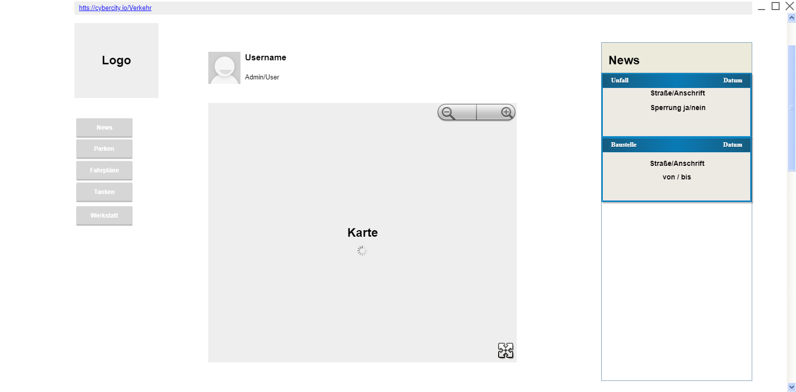
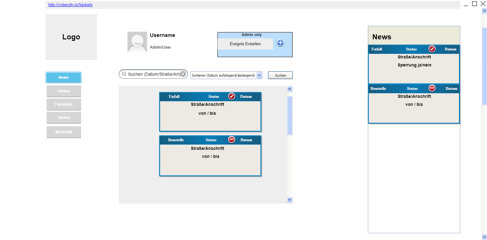
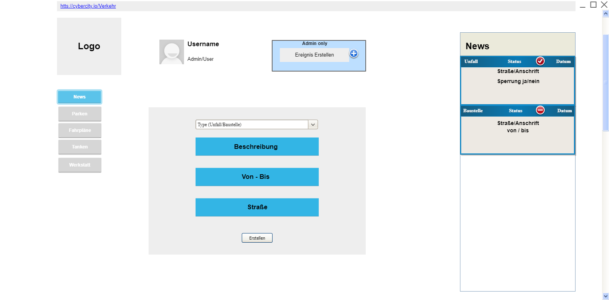
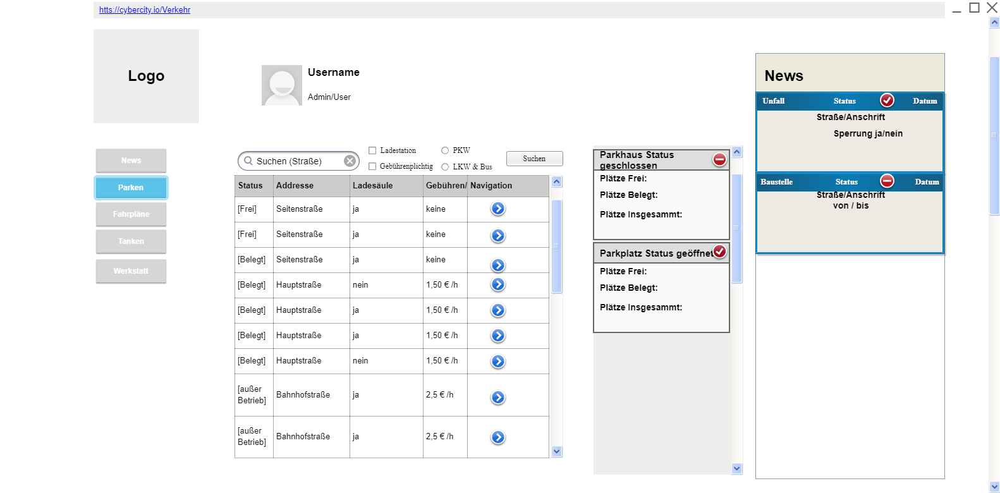
.png)
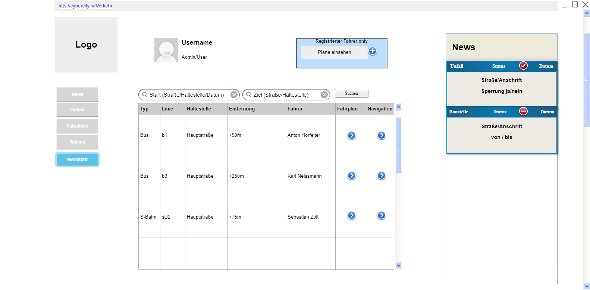
.png)
.png)
.png)
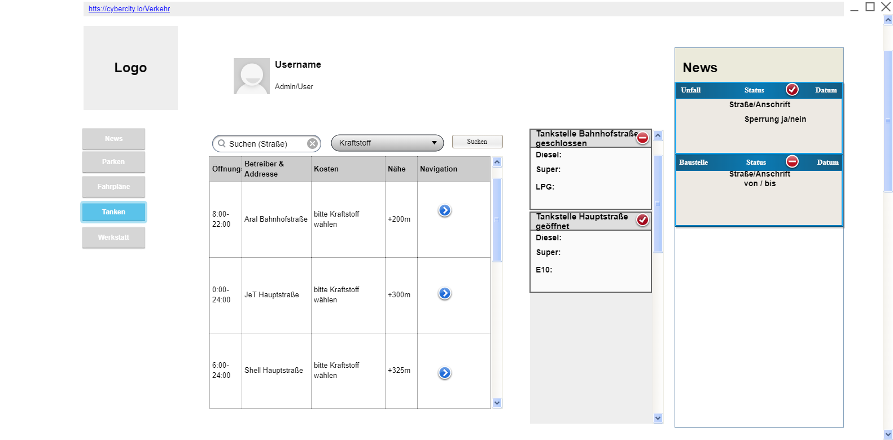
.png)
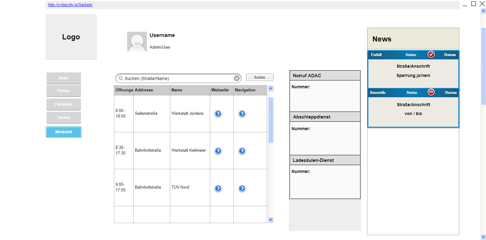
.png)

## Datenmodell 

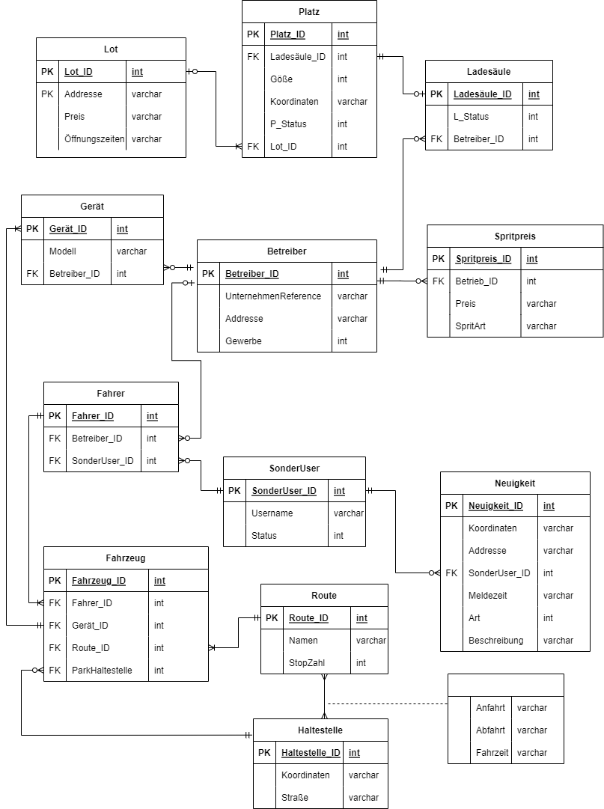

## Abläufe

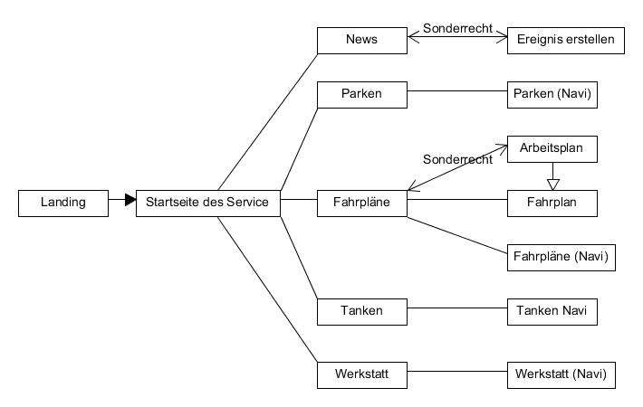

## Schnittstellen

* Abhängigkeiten: Liste mit Kommunikationsabhängigkeiten zu anderen Microservices:
	
	- Authentifizierung
	- Unternehmen
	- Event BUS

### Commands

**Synchronous**

| **Name** | **Parameter** | **Resultat** |
| :------ | :----- | :------ |
| addFahrplan() | int id | int id |
| addParkplatz() | int id | int id |
| deleteFahrplan() | int id | - |
| deleteParkplatz() | int id | - |
| setFahrplan(param) | int id | String |
| setParkplatz(param) | int id | String |
| addEvent() | - | json |

**Asynchronous**

| **Name** | **Parameter** | **Resultat** |
| :------ | :----- | :------ |
| getFahrplan() | int id | int id |
| getEvent() | int id | int id |

### Events

**Customer event channel**

| **Name** | **Payload** | 
| :------ | :----- | 
| Customer Authorized | int id |

### Queries

| **Name** | **Parameter** | **Resultat** |
| :------ | :----- | :------ |
| getUnternehmen() | string type | Unternehmen [] list |
| getWorker() | joinUnternehmenList | int id |

### Dependencies

#### RPC

| **Service** | **Funktion** |
| :------ | :----- | 
| Authorization Service | authenticateUser() |

#### Event-Subscriptions

| **Service** | **Funktion** |
| :------ | :----- | 
| Unternehmen | GetUnternehmenCategoryWerkstatt |
| Unternehmen | GetUnternehmenCategoryTankstelle |
| Unternehmen | GetUnternehmenCategoryÖPNV |
| Unternehmen | GetUnternehmenCategoryUserJoinÖPNV |
| Unternehmen | GetUnternehmenCategoryFeuerwehr |
| Unternehmen | GetUnternehmenCategoryUserJoinFeuerwehr |
| Unternehmen | GetUnternehmenCategoryPolizei |
| Unternehmen | GetUnternehmenCategoryUserJoinPlizei |
| Unternehmen | GetUnternehmenCategoryMedia |
| Unternehmen | GetUnternehmenCategoryUserJoinMedia |

## Technische Umsetzung

### Softwarearchitektur

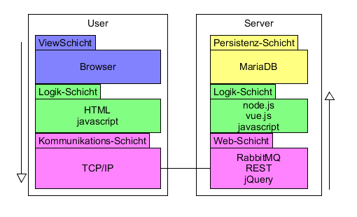

### Entwurf

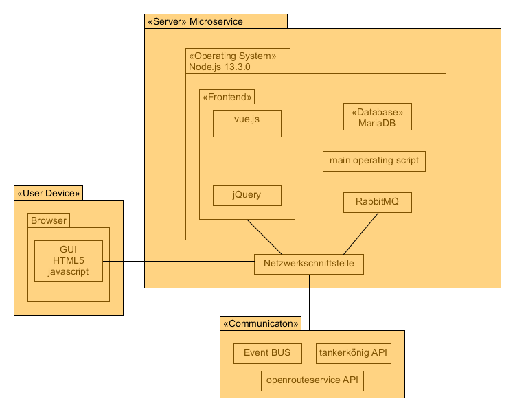
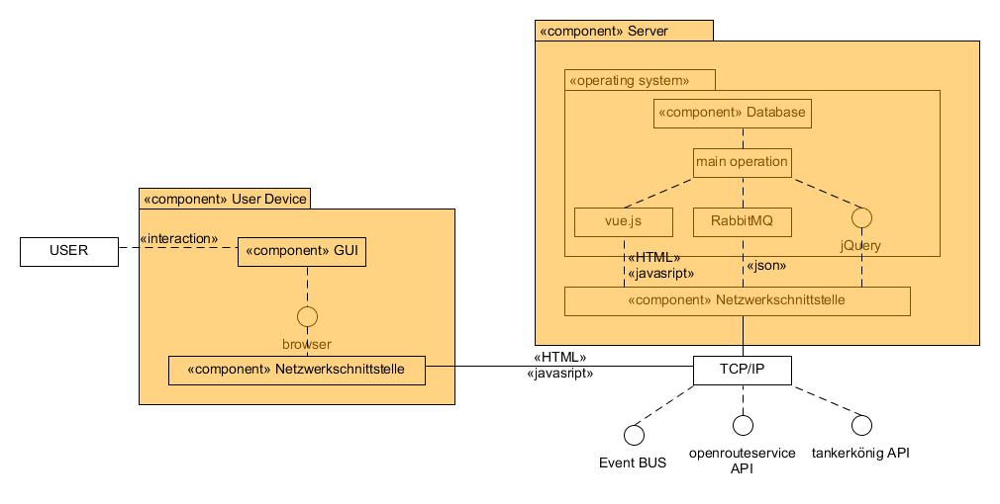

### Fehlerbehandlung 

* Mögliche Fehler:

	- Datenbank reagiert nicht
	- Serververbindung getrennt
	- Login Verifikation fehlgeschlagen
	- Daten konnten nicht richtig dargestellt werden 
	- News konnten nicht erstellt werden
	- News konnten nicht an den Eventbus weitergegeben werden
	- Daten eines anderen Services konnten nicht abgefragt werden
	- Darstellungsfehler 
	- Tankdaten konnten nicht abgefragt werden
	- Kartendaten konnten nicht erstellt werden

### Validierung

* Relevante Testfälle:
	
	- Darstellungen der Tabellen überprüfen
	- Probeweise Known Result Datenbankabfragen stellen
	- Daten an den Eventbus senden
	- Daten von anderen Services mit Known Result abfragen
	- Links überprüfen
	- Handshake mit REST APIs überprüfen
	- GUI auf unterschiedlichen Devices prüfen 

### Verwendete Technologien

- Verwendete Technologien (Programmiersprachen, Frameworks, etc.):

* Frontend
	- vue.js
	- bootstrap npm
	- jQuery
	- HTML5
	- CSS
* Backend
	- Node.js
	- JavaScript
	- Rest API
	- RabbitMQ
	- openrouteservice
	- Tankerkönig-API
* Datenbank
	- MariaDB (MySQL)
	- SQL
